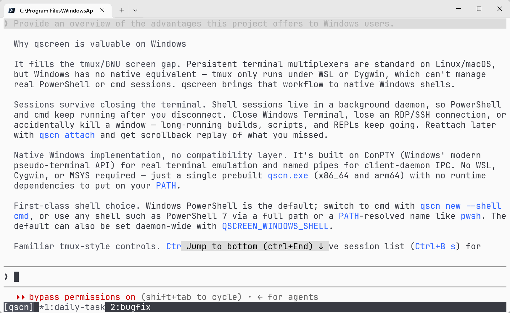
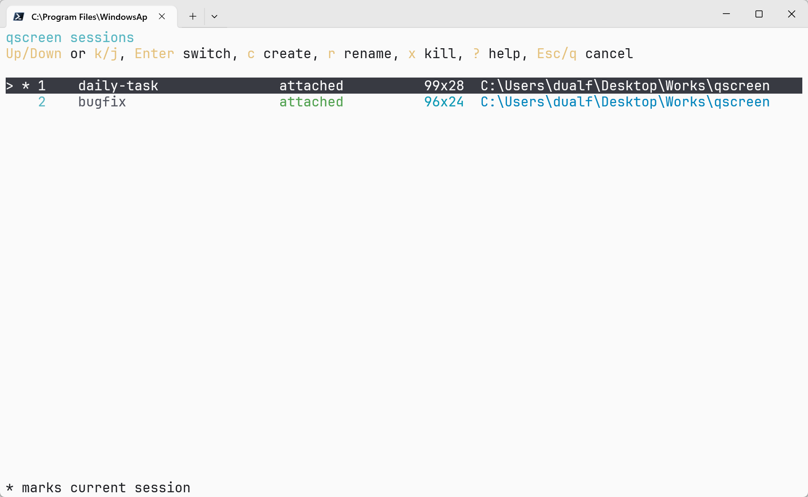
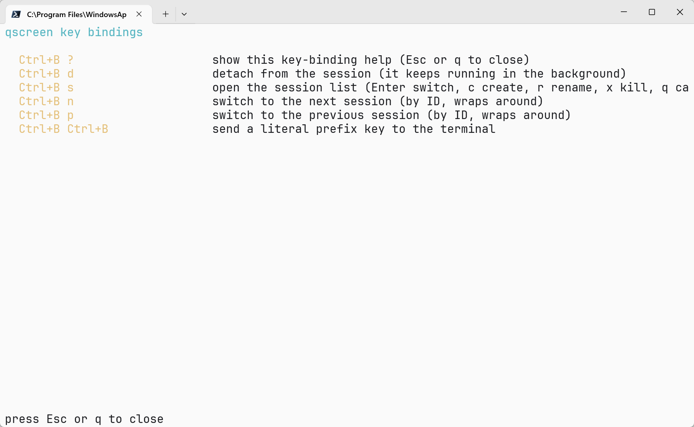

# qscreen

[](LICENSE)
[](https://github.com/dualface/qscreen/releases/latest)
[](https://github.com/dualface/qscreen/releases/latest)

`qscreen` is a lightweight, cross-platform terminal session manager — a simple
`tmux` / GNU `screen` style alternative for Windows, Linux, and macOS. It keeps
shell sessions alive in a background daemon, lets you detach and reattach at any
time (persistent sessions survive closing the terminal window), and provides a
small `tmux`-style command set through the `qscn` executable. On Windows it uses
ConPTY and named pipes, so PowerShell and cmd sessions keep running after you
disconnect.

## Screenshots

A live session with the status bar listing running sessions:



The built-in session list for switching, creating, renaming, and killing sessions:



The key-binding help screen:



## Features

- Create, list, attach, detach, and kill terminal sessions.
- Smart default command: create a session, attach the only session, or list multiple sessions.
- Background daemon starts on demand.
- Scrollback replay when reattaching.
- Built-in session list for switching, creating, renaming, and killing sessions without leaving the attach UI.
- Optional status bar showing live sessions and the current session.
- Multiple clients can attach to the same session; output is broadcast to all attached clients and each client can detach independently.
- Terminal sizing follows the latest active client: attaching, focusing, or sending input makes that client's size own the PTY, while inactive client resizes are remembered until that client becomes active.
- Localized CLI and interactive UI in English, Simplified Chinese, Traditional Chinese, Japanese, Spanish, German, and French, selected from the system locale.
- Windows, Linux, and macOS support.

## Remote Access with QuickTUI

qscreen powers persistent Windows terminal sessions in
[QuickTUI](https://quicktui.ai/), a self-hosted remote terminal for accessing
shells and AI coding agents from iPhone, iPad, and browsers. QuickTUI's Windows
installer installs `qscn` automatically and uses it as the default session
backend.

The companion app, **QuickTUI: AI Agent Terminal**, is available for iPhone and
iPad:

[](https://apps.apple.com/us/app/quicktui-ai-agent-terminal/id6761338192)

## Platform Notes

- Windows uses named pipes and starts `C:\Windows\System32\WindowsPowerShell\v1.0\powershell.exe` by default. Use `qscn new --shell cmd --name work` to start `C:\Windows\System32\cmd.exe` for a single session, or set the daemon environment variable `QSCREEN_WINDOWS_SHELL=cmd` or `QSCREEN_WINDOWS_SHELL=cmd.exe` to make cmd the daemon default. Explicit `powershell` and `powershell.exe` values keep the default PowerShell behavior. Any other value is treated as a shell executable: a full path (e.g. `C:\Program Files\PowerShell\7\pwsh.exe`) is validated to exist, while a bare command name (e.g. `pwsh`) is resolved via `PATH`. A path that does not exist returns an error and prevents session creation.
- Linux/macOS use Unix domain sockets and start `$SHELL -l`, falling back to `/bin/sh -l`. `qscn new --shell <path>` overrides the shell path for one session.
- New sessions inherit the directory where `qscn` is run. `qscn new --cwd <path>` overrides it; a session created from the interactive session list inherits the selected session's recorded startup directory. This value does not follow later `cd` commands inside the shell.
- Sessions are addressed by daemon-assigned numeric `session_id` values. The
  session name is only a display name, and custom names must match
  `[A-Za-z0-9._-]` and be at most 64 characters.

## Installation

Download a prebuilt `qscn` binary for Windows (x86_64/arm64), Linux
(x86_64/arm64), or macOS (arm64) from the
[GitHub Releases page](https://github.com/dualface/qscreen/releases/latest),
unpack the archive, and put `qscn` (or `qscn.exe`) somewhere on your `PATH`.

Alternatively, build from source as described below.

## Build

Requires stable Rust. The workspace is Rust 2024 edition.

```sh
cargo build
cargo build --release
cargo test
```

The Makefile wraps common Cargo commands:

```sh
make build
make release
make test
make clean
```

## Usage

```sh
qscn                         # smart launch
qscn new                     # create a session named after its auto-assigned session_id
qscn new --name work         # create and attach with display name work
qscn new --shell cmd         # create an auto-named cmd session on Windows
qscn new --shell /bin/zsh     # create an auto-named zsh session on Unix
qscn new --shell cmd --name work
qscn new --cwd C:\work --name work
qscn attach                  # attach to the highest-ID live session
qscn attach 1                # reattach to session_id 1
qscn att 1                   # alias for attach
qscn -r 1                    # alias for attach
qscn ls                      # list sessions
qscn list                    # alias for ls
qscn rename 1 work           # change the display name for session_id 1
qscn kill 1                  # terminate session_id 1
qscn shutdown                # stop daemon and close sessions
qscn --version               # print the qscn version (alias: -V)
```

Custom prefix keys:

```sh
qscn --prefix C-a attach 1    # attach with Ctrl+A as the session prefix
qscn --prefix C-a new --name work
qscn --prefix C-a             # smart launch with Ctrl+A as the session prefix
qscn --status-bar off attach 1 # hide the status bar for this attach
```

Prefix values accept `C-a` through `C-z` or `Ctrl+A` through `Ctrl+Z`.
`QSCREEN_PREFIX` sets a fallback prefix for every command:

```sh
QSCREEN_PREFIX=C-a qscn attach 1
```

When both are set, `--prefix` takes precedence over `QSCREEN_PREFIX`.
When neither is set, `qscn` uses `Ctrl+B`.

The status bar is enabled by default while attached. It uses the bottom row to
list live sessions, marks the current session with `*`, and refreshes every two
seconds. Use `--status-bar off` for one command or set
`QSCREEN_STATUS_BAR=off` as the fallback. The accepted values are `on` and
`off` (also `1|true|yes` and `0|false|no`, case-insensitively); the CLI option
takes precedence over the environment variable. The bar is automatically
disabled when the terminal is fewer than three rows high.

Inside a session:

- `<prefix> ?`: show the key-binding help screen (Esc or q to close).
- `<prefix> d`: detach, leaving the session running.
- `<prefix> <prefix>`: send a literal prefix key to the shell.
- `<prefix> s`: open the session list. Use Up/Down or `k`/`j` to move, Enter to switch, `c` to create, `r` to rename, `x` to kill, `?` for help, and Esc or `q` to close.
- `<prefix> n` / `<prefix> p`: switch to the next / previous live session by numeric ID, wrapping at either end.

If the current session exits, or is killed from the session list, qscreen
automatically attaches to the highest-ID remaining live session. If no live
sessions remain, it shuts down the daemon and exits.

With the default prefix, those controls are `Ctrl+B ?`, `Ctrl+B d`,
`Ctrl+B Ctrl+B`, `Ctrl+B s`, `Ctrl+B n`, and `Ctrl+B p`. With
`qscn --prefix C-a ...`, replace `Ctrl+B` with `Ctrl+A`.

`qscn ls` prints:

```text
<session_id>  <name>  <state>  <created-at>  <terminal-size>  <startup-directory>
```

States are `attached`, `detached`, or `exited(<code>)`.

The UI language follows `LC_ALL`, `LC_MESSAGES`, and `LANG`; on POSIX systems a
GNU `LANGUAGE` preference list is also honored, and Windows falls back to the
user locale. Unsupported locales use English. Script-oriented `qscn ls` state
labels remain English. Color output is auto-detected and can be controlled with
`QSCREEN_COLOR=always|never|auto`; `NO_COLOR` and `CLICOLOR_FORCE` are also
honored.

More than one terminal can attach to an existing session. All attached terminals
receive the same session output. Detaching one terminal leaves the session and
other attached terminals running. A session is shown as `attached` while at least
one client is attached.

The daemon tracks a size for each attached client. The PTY uses the most recent
active client's size, where active means the client just attached, gained focus,
or sent input. Resize events from an inactive client update that client's stored
size without immediately resizing the PTY; the stored size is applied when that
client next becomes active.

Machine clients can request byte-stream attach by sending an attach request with
`"attach_mode":"bytes"`. The daemon replies with `output` events using
`payload_b64`, starting with the current scrollback snapshot when non-empty, then
live PTY bytes. Omitting `attach_mode` keeps the default frame attach used by
`qscn`.

## Project Layout

- `crates/qscreen-client`: CLI binary, terminal UI, daemon launcher.
- `crates/qscreen-daemon`: session state, PTY lifecycle, IPC server.
- `crates/qscreen-protocol`: JSON-line wire protocol and validation.
- `crates/qscreen-shared`: shared IPC names, paths, and user helpers.

## Development

Before sending changes:

```sh
cargo fmt --all
cargo clippy --workspace --all-targets -- -D warnings
cargo test --workspace
```

For Windows cross-checks:

```sh
cargo check --workspace --target x86_64-pc-windows-gnu
```

## License

`qscreen` is distributed under the [MIT License](LICENSE).

The vendored `crates/vt100-psmux` crate is derived from the
[`vt100`](https://crates.io/crates/vt100) crate and keeps its original MIT
license; see `crates/vt100-psmux/LICENSE`.
